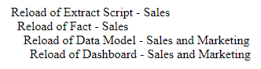

# qlik-task-path-prettification-machine
Even Qlik Sense task paths deserve to be beautiful. Use this script to create a nested HTML list of your Qlik Sense reload task chain.

## Usage Instructions
1. Clone this project to a location on your hard drive.
2. Install dependencies, if necessary, with `pip install pandas` and `pip install xlrd`
3. Go to your Qlik Sense Operations Monitor app's Task Planning sheet.
4. Select the task chains you want to visualize with this tool.
5. Right-click on the task path cell, and choose the "Export > Export data" menu option.
6. Save the file as input.xlsx to the /input/ directory.
7. Run `python3 prettify.py` or `python prettify.py` in terminal or command prompt after navigating to the project root folder.
8. Open the output.html file to view your beautifully-displayed reload task chain!

## Before

## After

### When Viewed In Browser

### HTML Structure
`<!DOCTYPE html>
<html lang="en">
<head>
<title>Qlik Sense Reload Task Chain</title>
</head>
<body>

<ul>
    <li>Reload of Extract Script - Sales</li>
    <li>
        <ul>
            <li>Reload of Fact - Sales</li>
            <li>
                <ul>
                    <li>Reload of Data Model - Sales and Marketing</li>
                    <li>
                        <ul>
                            <li>Reload of Dashboard - Sales and Marketing</li>
                        </ul>
                    </li>
                </ul>
            </li>
        </ul>
    </li>
</ul>

</body>
</html>`
